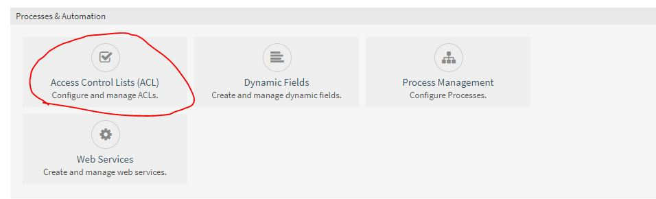
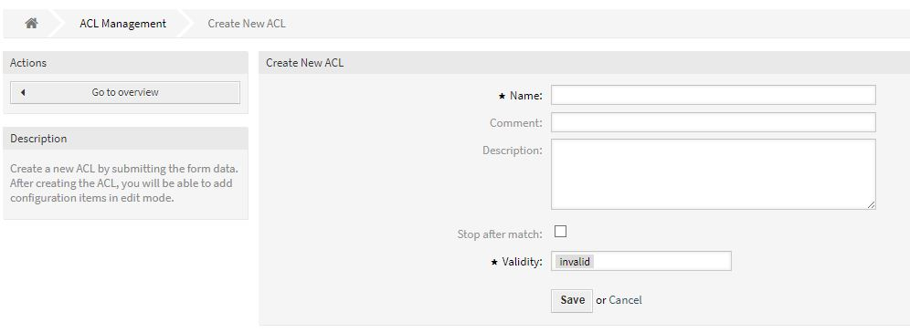
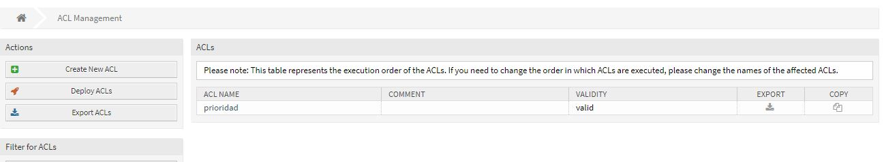

# Trabajo idp tema 11
## Hecho por: Ricardo Rizo Aguiar  

### Crear ACLs

Bueno un ACL es una lista que especifica los permisos de los usuarios sobre un archivo, carpeta u otro objeto. Un ACL define cuales usuarios y cuales grupos pueden accesar y que tipo de operaciones pueden realizar una vez dentro.

Como en todos las cosas que hemos explicado en estos informes, tenemos que ir a **admin** y seleccionar el icono que muestra la lustracion.

Despues es darle al icono de **Create New ACL** para crear la lista.

Reñenamos los datos, los permisos, etc. Que queremos darle a los usuarios.

Esta ultima imagen es el resultado de una lista que he creado para monstrar el resultado.
 

