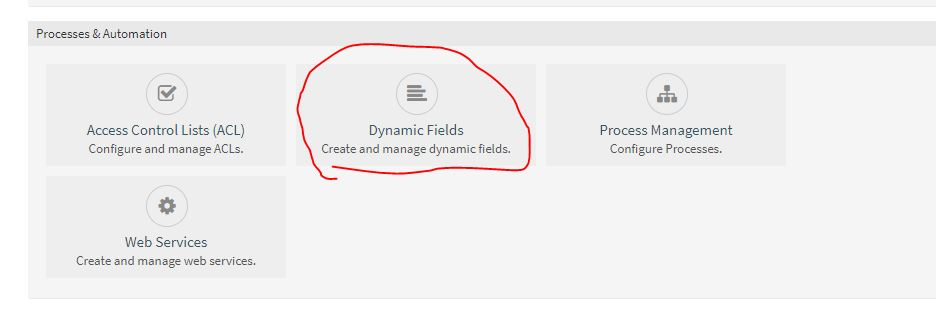
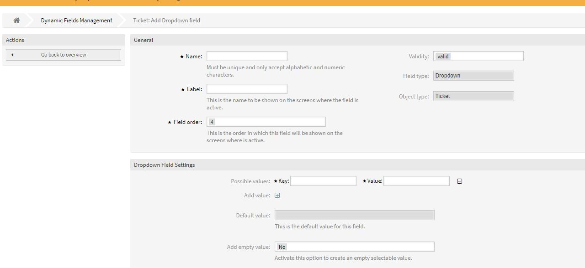
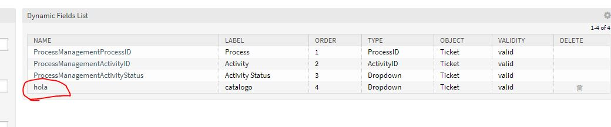

# Trabajo idp tema 11
## Hecho por: Ricardo Rizo Aguiar  

### Crear campos dinamicos

Ahora vamos a crear campos dinamicos para una mejor gestión.Nos vamos a **admin** y seleccionamos el icono que se muestra.

Bueno lo primero es seleccionar el tipo de ticket que queremos.

Despues establecemos los datos que nos pide la tabla y los valores que coge o su clave.

En la siguiente iamgen e puesto un campo creado llamado **hola** el cual cree para monstrar el resultado final.
 

