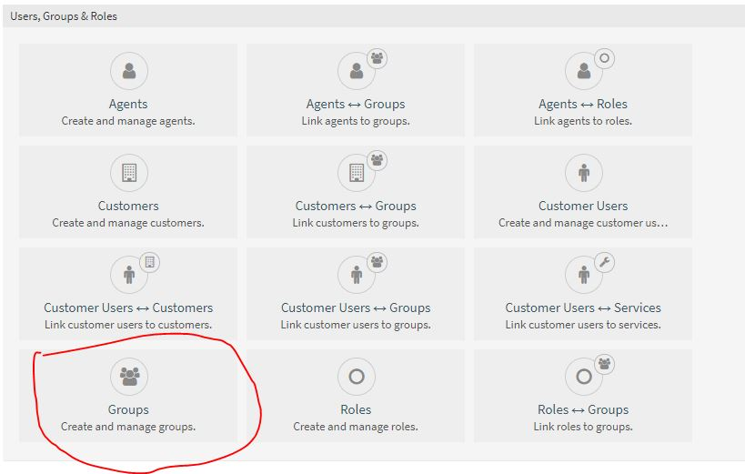
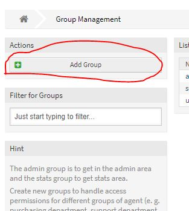
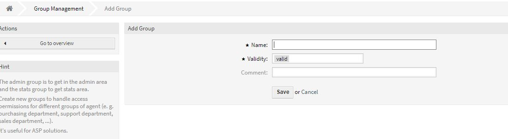
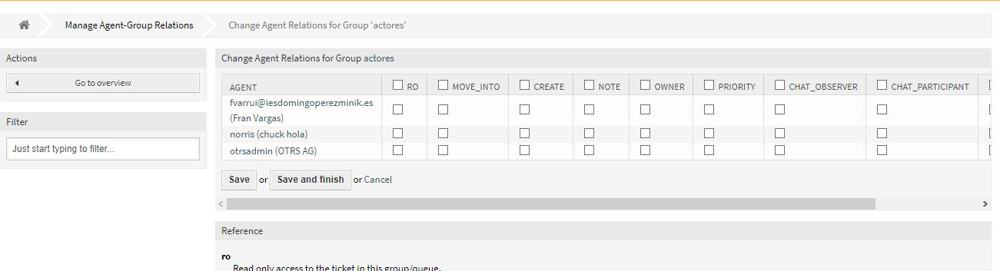

# Trabajo idp tema 11
## Hecho por: Ricardo Rizo Aguiar  

### Crear grupos

Los grupos se crean de la misma forma que los agentes.
Lo primero es ir a **admin** y seleccionar el icono que se indica en la imagen.

Hacemos click sobre el icono de **Add Group**.

A continuación le damos la informacion para el grupo y le damos a save.

Por ultimo es seleccionar los agentes y los permisos.
 
