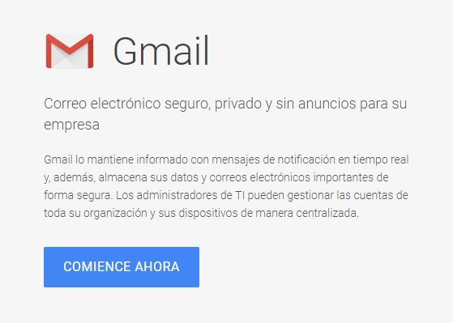
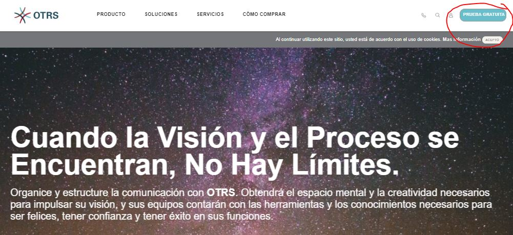
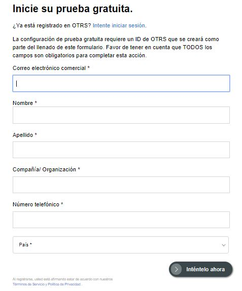
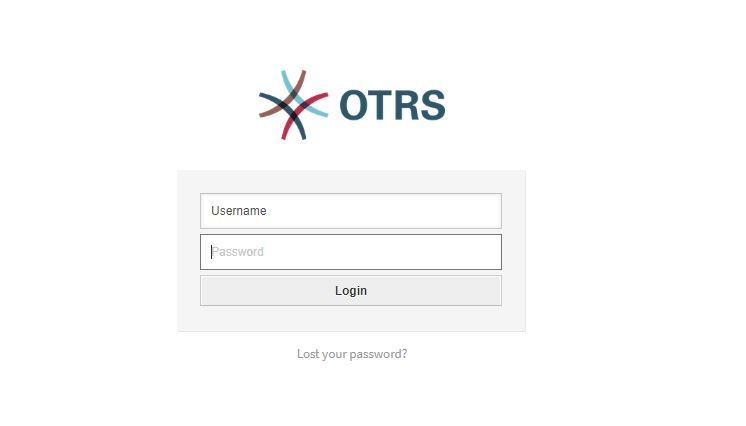

# Trabajo idp tema 11
## Hecho por: Ricardo Rizo Aguiar  

### Instalacion de OTRS

Lo primero que vamos a hacer crear un correo comercial que vamos a tener que  utilizar mas adelante para poder utilizar OTRS.

El siguiente paso es entrar al buscador y entrar en la pagina oficial de OTRS que es (https://otrs.com/es/home/) y le damos al icono de prueba gratis.

Nos va a pedir que reñenemos esta tabla con nuestros datos personales.

Cuando terminamos nos enviara un correo con los datos de la cuenta y una url para que nos lleve a OTRS para iniciar seccion.
 

