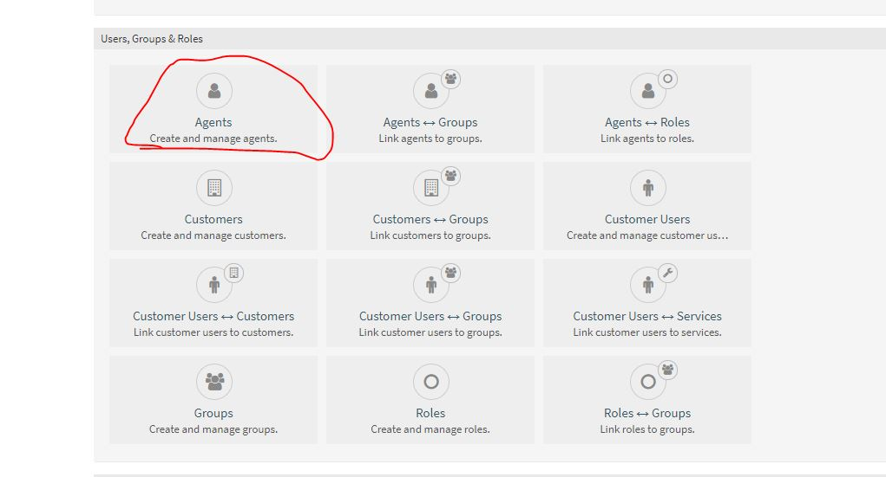
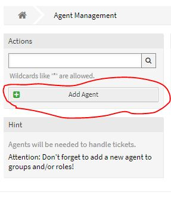
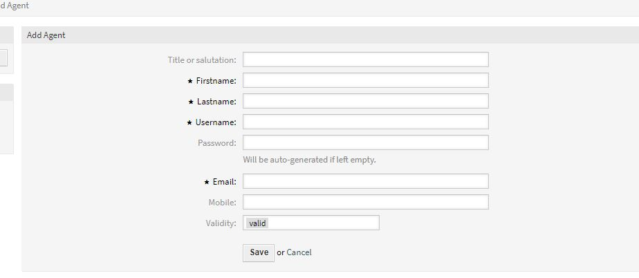

# Trabajo idp tema 11
## Hecho por: Ricardo Rizo Aguiar  

### Crear agentes

Lo primero es ir a **admin**.

Despues tenemos que al icono que muestra la imagen.

Le damos al icono de **Add Agent**.

Reñenamos la tabla con los datos del usuario que queremos crear.
 

Por ultimo podemos seleccionar los grupos y los permisos que podemos darle. 

